## SkyOptima

### Key Features

- **Advanced Demand Forecasting:**  
  - Combines classical time-series models (ARIMA, exponential smoothing) with cutting-edge deep learning (LSTM/GRU) and ensemble methods.
  - Incorporates causal econometric models and machine learning techniques to capture complex booking patterns.

- **Dynamic Pricing & Revenue Optimization:**  
  - Utilizes reinforcement learning to adapt pricing strategies in real time.
  - Implements EMSR and overbooking policies to balance early low-fare sales with maximizing revenue from higher-paying customers.
  - Conducts Monte Carlo simulations and what-if analyses for risk-informed decision-making.

- **Robust Data Integration & Governance:**  
  - Ingests data from diverse internal and external sources, including competitor pricing, market trends, weather, and economic indicators.
  - Enforces strict data governance, anomaly detection, and provenance tracking, with optional blockchain integration for data integrity.

- **Scalable, Microservices-Based Architecture:**  
  - Built with containerized microservices (Docker/Kubernetes) and automated CI/CD pipelines for global scalability and high availability.
  - Supports real-time streaming (Apache Kafka/Spark Streaming) and edge computing to reduce latency.

- **Comprehensive Monitoring & Operational Excellence:**  
  - Features interactive dashboards, multi-tiered alerting systems, and extensive automated testing (unit, integration, performance, and security).
  - Includes detailed runbooks, disaster recovery plans, and operational best practices for smooth, resilient operations.

- **Cross-Functional Integration & Agile Alignment:**  
  - Seamlessly integrates with legacy systems and internal platforms via robust APIs.
  - Supported by comprehensive documentation, including strategic planning (OKRs, roadmaps, brand guidelines) and technical guides (architecture, design, DevOps, security, release management).

### Purpose

SkyOptima is designed to be the benchmark solution for airline revenue management—helping carriers like Etihad and Emirates unlock the full potential of their network by using data-driven insights to adapt to market dynamics, improve forecasting accuracy, and drive optimal pricing strategies.

```mermaid
flowchart TD
 subgraph DS["Data Sources"]
        DS1["Internal Data<br>Bookings, Revenue, Load Factors"]
        DS2["External Data<br>Competitor Pricing, Weather, Events, Economic"]
  end
 subgraph DI["Data Ingestion & ETL"]
        DI1["Batch Ingestion<br>ETL Pipelines"]
        DI2["Real-Time Streaming<br>Kafka/Spark Streaming"]
        DI3["Data Governance & Validation"]
  end
 subgraph DSWH["Data Storage"]
        DSWH1["Enterprise Data Lake/Warehouse"]
  end
 subgraph DP["Data Processing & Feature Engineering"]
        DP1["Data Cleaning & Deduplication"]
        DP2["Data Enrichment & Fusion"]
        DP3["Feature Extraction<br>Temporal, Statistical, Interaction"]
  end
 subgraph QA["Quality Assurance & Automated Testing"]
        QA1["Automated Unit/Integration Tests"]
        QA2["Performance & Stress Tests"]
        QA3["Security & Compliance Tests"]
  end
 subgraph ML["Modeling Layer"]
        ML1["Baseline Forecasting Models<br>ARIMA, Exponential Smoothing"]
        ML2["Advanced Deep Learning Models<br>LSTM/GRU"]
        ML3["XGBoost & Ensemble Methods"]
        ML4["Reinforcement Learning Module"]
        ML5["Adaptive Ensemble Strategy"]
  end
 subgraph RO["Revenue Optimization"]
        RO1["Dynamic Pricing Engine<br>with Carbon-Aware &amp; Currency Hedge Adjustments"]
        RO2["Simulation & Monte Carlo Analysis"]
        RO3["Optimization Algorithms<br>Linear/MIP Programming"]
  end
 subgraph API["Integration & APIs"]
        API1["Internal RESTful APIs"]
        API2["Legacy System Adapters<br>IATA NDC / ONE Order"]
        API3["External Data Connectors"]
  end
 subgraph UI["User Interface / BI"]
        UI1["Interactive Dashboards"]
        UI2["BI Reporting Tools<br>Tableau/Power BI"]
  end
 subgraph MLS["Monitoring, Logging, Security & Governance"]
        MLS1["Real-Time Monitoring Dashboards"]
        MLS2["Automated Alerting & Anomaly Detection"]
        MLS3["Centralized Logging & Audit Trails"]
        MLS_PRASK["PRASK KPI Calculation"]
        MLS4["Security & Compliance Modules"]
        MLS5["Governance & Regulatory Processes"]
  end
 subgraph CI["Continuous Improvement & Feedback"]
        CI1["Automated Feedback Collection"]
        CI2["Agile Retrospectives & Change Management"]
        CI3["Knowledge Management & Training Updates"]
  end
 subgraph ID["Infrastructure & Deployment"]
        ID1["Containerization<br>Docker"]
        ID2["Orchestration<br>Kubernetes"]
        ID3["CI/CD Pipeline<br>Automated Testing &amp; Deployment"]
        ID4["Auto-Scaling, Geo-Redundancy & Cost Optimization"]
        ID5["Vendor & Cost Management Integration"]
  end
 subgraph OE["Optional Enhancements"]
        OE1["Edge Computing<br>Ultra-Low Latency Processing"]
        OE2["Blockchain Integration<br>Immutable Audit Trails"]
  end
    DS1 --> DI1 & DI2
    DS2 --> DI1 & DI2
    DI1 --> DI3
    DI2 --> DI3
    DI3 --> DSWH1
    DSWH1 --> DP1
    DP1 --> DP2
    DP2 --> DP3
    DP3 --> QA1 & ML1 & ML2 & ML3 & ML4
    QA1 --> QA2
    QA2 --> QA3
    ML1 --- ML5
    ML2 --- ML5
    ML3 --- ML5
    ML4 --- ML5
    ML5 --> RO1
    RO1 --> RO2 & RO3 & API1 & API2 & API3
    API1 --> UI1
    UI1 --> UI2 & MLS1
    MLS1 --> MLS2
    MLS2 --> MLS3
    MLS3 --> MLS_PRASK
    MLS_PRASK --> MLS4
    MLS4 --> MLS5
    MLS5 --> CI1
    CI1 --> CI2
    CI2 --> CI3
    CI3 --> ID1
    ID1 --> ID2
    ID2 --> ID3
    ID3 --> ID4
    ID4 --> ID5
    ID5 --> OE1 & OE2

     DS1:::VanGoghYellow
     DS2:::VanGoghYellow
     DI1:::MonetBlue
     DI2:::MonetBlue
     DI3:::MonetBlue
     DSWH1:::Pine
     DP1:::WarholPop
     DP2:::WarholPop
     DP3:::WarholPop
     QA1:::OrozcoTeal
     QA1:::MiroTeal
     QA2:::MiroTeal
     QA3:::MiroTeal
     ML1:::DegasGreen
     ML2:::DegasGreen
     ML3:::DegasGreen
     ML4:::DegasGreen
     ML5:::DegasGreen
     RO1:::MatisseCoral
     RO2:::MatisseCoral
     RO3:::MatisseCoral
     API1:::Ash
     API1:::TurnerMist
     API2:::Ash
     API2:::TurnerMist
     API3:::Ash
     API3:::TurnerMist
     UI1:::GoldFoil
     UI2:::GoldFoil
     MLS1:::MatisseLavender
     MLS2:::MatisseLavender
     MLS3:::MatisseLavender
     MLS_PRASK:::MatisseLavender
     MLS4:::MatisseLavender
     MLS5:::MatisseLavender
     CI1:::Aqua
     CI2:::Aqua
     CI3:::Aqua
     ID1:::Sky
     ID2:::Sky
     ID3:::Sky
     ID4:::Sky
     ID5:::Sky
     OE1:::Ash
     OE2:::Ash
    classDef PicassoBlue stroke-width:1px, stroke-dasharray:none, stroke:#5A84A2, fill:#CDE0F2, color:#2D4661  
    classDef CezannePeach stroke-width:1px, stroke-dasharray:none, stroke:#E2A07D, fill:#FBE7DA, color:#6D4532
    classDef Rose stroke-width:1px, stroke-dasharray:none, stroke:#FF5978, fill:#FFDFE5, color:#8E2236
    classDef KlimtGold stroke-width:1px, stroke-dasharray:none, stroke:#D4A017, fill:#FBF2C1, color:#705A16
    classDef Peach stroke-width:1px, stroke-dasharray:none, stroke:#FBB35A, fill:#FFEFDB, color:#8F632D
    classDef RenoirPink stroke-width:1px, stroke-dasharray:none, stroke:#E4A0A0, fill:#FBE5E5, color:#7D3E3E
    classDef HokusaiWave stroke-width:1px, stroke-dasharray:none, stroke:#6188A9, fill:#D4E8F2, color:#2A425D
    classDef PollockChaos stroke-width:1px, stroke-dasharray:none, stroke:#8A0303, fill:#F2C6C6, color:#520000
    classDef OkeeffeSunset stroke-width:1px, stroke-dasharray:none, stroke:#FF9933, fill:#FFF2E6, color:#CC6600
    classDef MondrianRed stroke-width:1px, stroke-dasharray:none, stroke:#CC0000, fill:#FFCCCC, color:#990000
    classDef HockWaveBlue stroke-width:1px, stroke-dasharray:none, stroke:#1976D2, fill:#BBDEFB, color:#0D47A1
    classDef VanGoghYellow stroke-width:1px, stroke-dasharray:none, stroke:#E3B448, fill:#FDF6C9, color:#7D5A17
    classDef MonetBlue stroke-width:1px, stroke-dasharray:none, stroke:#87AFC7, fill:#D4EAF7, color:#30577B
    classDef Pine stroke-width:1px, stroke-dasharray:none, stroke:#254336, fill:#27654A, color:#FFFFFF
    classDef WarholPop stroke-width:1px, stroke-dasharray:none, stroke:#FF3366, fill:#FFE6F0, color:#B3003E
    classDef DegasGreen stroke-width:1px, stroke-dasharray:none, stroke:#A7C796, fill:#E6F4E2, color:#3E6A42
    classDef OrozcoTeal stroke-width:1px, stroke-dasharray:none, stroke:#009688, fill:#E0F2F1, color:#00695C
    classDef MiroTeal stroke-width:1px, stroke-dasharray:none, stroke:#008080, fill:#B2DFDB, color:#005757
    classDef MatisseCoral stroke-width:1px, stroke-dasharray:none, stroke:#FF7043, fill:#FFE0B2, color:#BF360C
    classDef TurnerMist stroke-width:1px, stroke-dasharray:none, stroke:#B8C4D1, fill:#EAF2F8, color:#4A5B6F
    classDef GoldFoil stroke-width:1px, stroke-dasharray:none, stroke:#C5941B, fill:#F7EBD8, color:#C5941B
    classDef MatisseLavender stroke-width:1px, stroke-dasharray:none, stroke:#B39DBC, fill:#ECE3F5, color:#4E3A5E
    classDef Aqua stroke-width:1px, stroke-dasharray:none, stroke:#46EDC8, fill:#DEFFF8, color:#378E7A
    classDef Sky stroke-width:1px, stroke-dasharray:none, stroke:#374D7C, fill:#E2EBFF, color:#374D7C
    classDef Ash stroke-width:1px, stroke-dasharray:none, stroke:#999999, fill:#EEEEEE, color:#000000
    style DS fill:transparent
    style DI fill:transparent
    style DP fill:transparent
    style ML fill:transparent
    style QA fill:transparent
    style RO fill:transparent
    style API fill:transparent
    style UI fill:transparent
    style MLS fill:transparent
    style ID fill:transparent
    style OE fill:transparent
```

---
