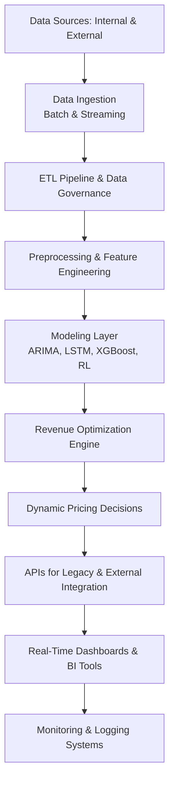

# Architecture & Design Documentation

## System Overview
SkyOptima is designed as a modular, microservices-based system that provides real-time demand forecasting and dynamic revenue optimization for the airline industry. The system leverages a combination of classical time-series models, deep learning, and reinforcement learning to deliver accurate predictions and adaptive pricing strategies.

## Architectural Components

### 1. **Data Ingestion Layer**
- **Batch Processing:** - Uses ETL pipelines (built with Python, Apache Airflow) for historical data extraction.
- **Real-Time Streaming:** - Implements Apache Kafka/Spark Streaming for low-latency data updates.
- **Data Governance:** - Ensures schema validation, deduplication, and data fusion from multiple sources.

### 2. **Data Processing & Analytics Layer**
- **Preprocessing:** - Data normalization, enrichment, and anomaly detection modules.
- **Feature Engineering:** - Extracts and transforms raw data into predictive features (lag variables, rolling averages, interaction terms).
- **Analytics:** - Real-time dashboards and BI integration (Tableau/Power BI) for monitoring KPIs.

### 3. **Modeling Layer**
- **Baseline Models:**- ARIMA and exponential smoothing models.
- **Advanced Machine Learning:**- Deep learning models (LSTM/GRU) and ensemble methods (XGBoost, adaptive ensemble).
- **Reinforcement Learning:**- RL modules that adapt pricing strategies based on real-time market feedback.
- **Validation:** - Continuous model retraining and hyperparameter tuning using rolling cross-validation.

### 4. **Revenue Optimization & Pricing Layer**
- **Dynamic Pricing Engine:**- Integrates pricing strategies such as EMSR and overbooking policies.
- **Optimization Algorithms:**- Uses linear programming and mixed-integer programming to determine optimal pricing.
- **Fallback Mechanisms:**- Automated alerts and predefined risk guard rails for market volatility.

### 5. **Integration and API Layer**
- **Internal APIs:**- RESTful APIs for inter-service communication and data exchange.
- **Legacy System Integration:**- Adapters for interfacing with existing airline reservation and ticketing systems.
- **External Integrations:**- API connectors for competitor data, market trends, and external analytics feeds.

### 6. **Infrastructure and Deployment Layer**
- **Containerization:**- Docker-based microservices deployed on Kubernetes.
- **CI/CD Pipeline:**- Automated build, test, and deployment pipelines (Jenkins/GitLab CI).
- **Monitoring and Logging:**- Real-time monitoring dashboards, automated alerting systems, and centralized logging (ELK Stack).

## Design Principles
- **Modularity:**- Loose coupling between services ensures easy maintenance and scalability.
- **Resilience:**- Fault-tolerant design with auto-scaling, load balancing, and geo-redundancy.
- **Security:**- End-to-end encryption, strict access controls, and regular security audits.
- **Scalability:**- Designed to handle massive data volumes with distributed processing and cloud-native architectures.

## Data Flow Diagram

